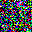
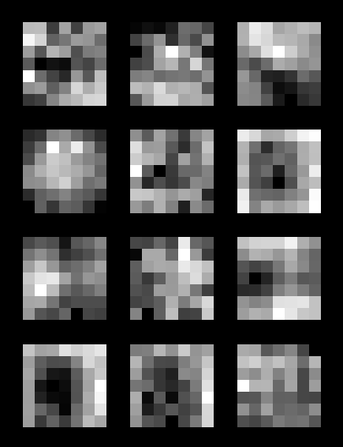
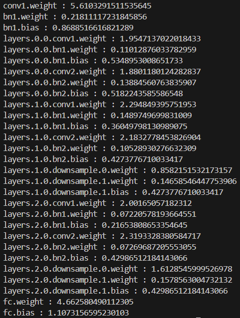
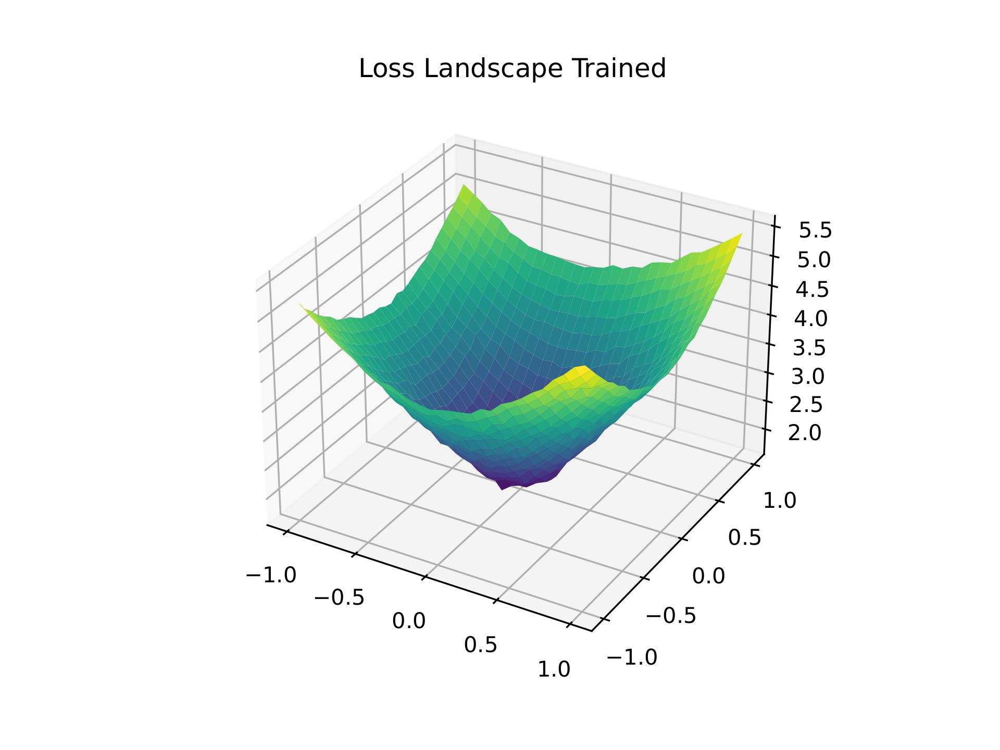
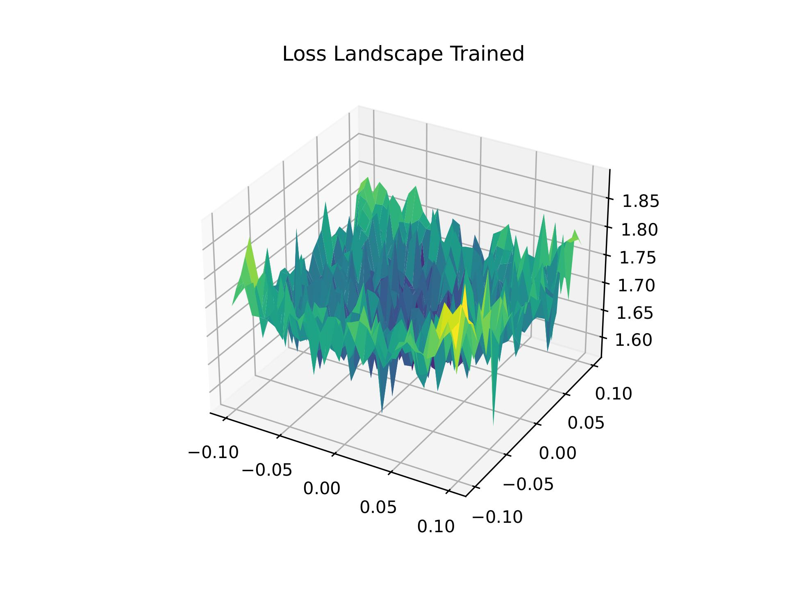

# Visualizations

This section contains some visualization utilities to visualize some characteristics of the model.

## Supported Algorithms

### Activation Maximization

Activation Maximization is a techique to visualize the features learned by a neural network. It is done via gradient ascent, or finding pixel values that maximally activate a particular neuron. It can reflect the feature patterns the neuron focuses on.

Reference paper: [Visualizing Higher Layer Features of a Deep Network](https://www.researchgate.net/profile/Aaron-Courville/publication/265022827_Visualizing_Higher-Layer_Features_of_a_Deep_Network/links/53ff82b00cf24c81027da530/Visualizing-Higher-Layer-Features-of-a-Deep-Network.pdf).

Reference implement: [Nguyen-Hoa/Activation-Maximization](https://github.com/Nguyen-Hoa/Activation-Maximization).

To use it, you can see [demo](https://github.com/FLAIR-Community/Fling/blob/main/fling/utils/visualize_utils/demo/activation_maximization_demo.py): 

```python
def am_demo(path_head, model, layer, channel_id):
    working_dir = os.path.join(path_head, layer)
    activation_maximizer = ActivationMaximizer(iteration=1000, working_dir=working_dir, tv_weight=1)
    activation_maximizer.activation_maximization(
        model, layer, channel_id=channel_id, image_shape=[3, 32, 32], device='cuda', learning_rate=1e-1
    )


if __name__ == '__main__':
    # path to store the result
    name = 'demo'
    out_dir = os.path.join('./visualize/', name)

    # Step 1: prepare the model.
    model_arg = EasyDict(dict(
        name='resnet8',
        input_channel=3,
        class_number=100,
    ))
    model_name = model_arg.pop('name')
    model = MODEL_REGISTRY.build(model_name, **model_arg)
    print(model)

    # Step 2: Loop to perform am on each layer of the model.
    layers = [
        'conv1', 'layers.0.0.conv1', 'layers.0.0.conv2', 'layers.1.0.conv1', 'layers.1.0.conv2',
        'layers.1.0.downsample.0', 'layers.2.0.conv1', 'layers.2.0.conv2', 'layers.2.0.downsample.0', 'fc'
    ]
    for layer in layers:
        for channel_id in range(64):
            am_demo(out_dir, model, layer, channel_id)
```

In the "prepare the model" phase, you can choose to initialize the new model or load the pre-trained model parameters. Then use the `am_demo()` function to perform activation maximization on the specified `channel` of the specified `layer` of the model. In `am_demo()`, the relevant parameters of `ActivationMaximizer` can be adjusted, e.g., the `tv_weight` parameter indicates the weight of the total variance loss (TV-loss). The higher the weight, the “smoother” the image. And the `image_shape` parameter determines the shape of the generated image.

Below are some examples of visualization results, here we show the gif and image results generated by channel 4 of the first convolutional layer “pre_conv” of the ResNet8 model:

- `pre_conv_4.gif`:

  

- `pre_conv_4_final.png`:

  

### Convolution Kernel Visualizer

This visualizer is to plot the kernels in a certain convolution layer for better visualization. It can help us analyze which kind of semantic information the model extract.

To use it, you can see [demo](https://github.com/FLAIR-Community/Fling/blob/main/fling/utils/visualize_utils/demo/demo_conv_kernel_visualize.py): 

```python
if __name__ == '__main__':
    # Step 1: prepare the model.
    model_arg = EasyDict(dict(
        name='resnet8',
        input_channel=3,
        class_number=100,
    ))
    model_name = model_arg.pop('name')
    model = MODEL_REGISTRY.build(model_name, **model_arg)

    # You can also initialize the model without using configurations.
    # e.g. model = resnet18(pretrained=True)

    # Step 2: prepare the logger.
    logger = Logger('resnet18_conv_kernels')

    # Step 3: save the kernels.
    plot_conv_kernels(logger, layer=model.conv1, name='pre-conv')
```

In the "prepare the model" phase, you can choose to initialize the new model or load the pre-trained model parameters. In the `plot_conv_kernels()` function, the parameter `layer` is used to select the specified convolutional layer for convolution kernel visualization.

Below are some examples of visualization results, here we show the results of the convolution kernel visualization for the first few channels of the first convolutional layer of the ResNet-8 model:



### Hessian Dominant Eigenvalue

In this class, we use power iteration to calculate each dominant eigenvalue of each layer in the model. The eigenvalue of a Hessian means “the change in the gradient of a loss function as we step an infinitesimal distance in a given direction.” It can reflect to some extent the intensity of the upcoming change in the parameter gradient.

Reference paper: [HAWQ: Hessian AWare Quantization of Neural Networks with Mixed-Precision](https://arxiv.org/pdf/1905.03696)

To use it, you can see [demo](https://github.com/FLAIR-Community/Fling/blob/main/fling/utils/visualize_utils/demo/demo_hessian_eigen_value.py): 

```python
if __name__ == '__main__':
    # Step 1: prepare the dataset.
    dataset_config = EasyDict(dict(data=dict(data_path='./data/cifar10', transforms=dict())))
    dataset = DATASET_REGISTRY.build('cifar10', dataset_config, train=False)

    # Test dataset is for generating loss landscape.
    test_dataset = [dataset[i] for i in range(100)]
    test_dataloader = DataLoader(test_dataset, batch_size=100)

    # Step 2: prepare the model.
    model_arg = EasyDict(dict(
        name='resnet8',
        input_channel=3,
        class_number=10,
    ))
    model_name = model_arg.pop('name')
    model = MODEL_REGISTRY.build(model_name, **model_arg)

    # You can also initialize the model without using configurations.
    # e.g. model = ToyModel()

    # Step 3: train the randomly initialized model.
    dataloader = DataLoader(dataset, batch_size=100)
    device = 'cuda'
    model = model.to(device)
    model.train()
    optimizer = torch.optim.Adam(model.parameters(), lr=5e-4)
    criterion = torch.nn.CrossEntropyLoss()
    for _ in range(0):
        for _, (data) in enumerate(dataloader):
            data_x, data_y = data['input'], data['class_id']
            data_x, data_y = data_x.to(device), data_y.to(device)
            pred_y = model(data_x)
            loss = criterion(pred_y, data_y)
            optimizer.zero_grad()
            loss.backward()
            optimizer.step()
    model.to('cpu')

    # Step 4: calculate the hessian eigen values of the model.
    # Only one line of code for visualization.
    res = calculate_hessian_dominant_eigen_values(model, iter_num=20, dataloader=test_dataloader, device='cuda')
    print(res)
```

In the "prepare the model" phase, you can choose to initialize the new model or load the pre-trained model parameters. Before that, you need to prepare the `test_dataset` DataLoader to calculate the hessian eigen values. In the function `calculate_hessian_dominant_eigen_values()`, the argument `iter_num` denotes number of iterations using power iteration. The above function computes the corresponding hessian eigenvalues for each layer of the model's parameter matrix and returns a dict.

Here is an example of the results of a calculation on a ResNet-8 model:



### Loss Landscape

The loss landscape is a representation of the loss values around the weight space of the network. Currently, only linear layers and convolution layers will be considered.

Reference paper: [Visualizing the Loss Landscape of Neural Nets](https://proceedings.neurips.cc/paper_files/paper/2018/file/a41b3bb3e6b050b6c9067c67f663b915-Paper.pdf)

To use it, you can see [demo](https://github.com/FLAIR-Community/Fling/blob/main/fling/utils/visualize_utils/demo/demo_single_loss_landscape.py): 

```python
if __name__ == '__main__':
    # Step 1: prepare the dataset.
    dataset_config = EasyDict(dict(data=dict(data_path='./data/cifar10', transforms=dict())))
    dataset = DATASET_REGISTRY.build('cifar10', dataset_config, train=False)

    # Test dataset is for generating loss landscape.
    test_dataset = [dataset[i] for i in range(100)]
    test_dataloader = DataLoader(test_dataset, batch_size=100)

    # Step 2: prepare the model.
    model_arg = EasyDict(dict(
        name='resnet8',
        input_channel=3,
        class_number=10,
    ))
    model_name = model_arg.pop('name')
    model = MODEL_REGISTRY.build(model_name, **model_arg)

    # You can also initialize the model without using configurations.
    # e.g. model = ToyModel()

    # Step 3: train the randomly initialized model.
    dataloader = DataLoader(dataset, batch_size=100)
    device = 'cuda'
    model = model.to(device)
    model.train()
    optimizer = torch.optim.Adam(model.parameters(), lr=5e-4)
    criterion = torch.nn.CrossEntropyLoss()
    for _ in range(10):
        for _, (data) in enumerate(dataloader):
            data_x, data_y = data['input'], data['class_id']
            data_x, data_y = data_x.to(device), data_y.to(device)
            pred_y = model(data_x)
            loss = criterion(pred_y, data_y)
            optimizer.zero_grad()
            loss.backward()
            optimizer.step()
    model.to('cpu')

    # Step 4: plot the loss landscape after training the model.
    # Only one line of code for visualization!
    plot_2d_loss_landscape(
        model=model,
        dataloader=test_dataloader,
        device='cuda',
        caption='Loss Landscape Trained',
        save_path='./landscape.pdf',
        noise_range=(-1, 1),
        resolution=30,
        log_scale=True,
        max_val=20,
    )
```

First, you need to prepare the dataset and model used for the calculation. In the "prepare the model" phase, you can choose to initialize the new model or load the pre-trained model parameters. In `plot_2d_loss_landscape()` function, the parameter `noise_range` indicates the coordinate range of the loss-landscape. you can also adjust the `resolution` of the generated landscape. A larger resolution will cost longer time for computation, but a lower resolution may result in unclear contours. The parameter `max_val` represents the parameter max_val indicates the max value of permitted loss.

The results of a loss landscape visualization of a ResNet-8 model trained to convergence on the CIFAR-100 dataset are shown here. The results are shown for noise range of 1, 0.1 respectively:

- `landscape_1.jpg`:

  

- `landscape_0.1.jpg`:

  
